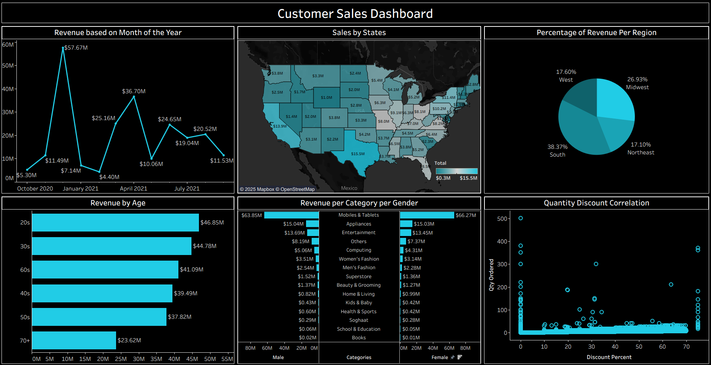

# Customer Sales Analysis Dashboard

This project presents a Tableau dashboard designed to analyze customer sales performance across multiple dimensions. It uncovers trends in revenue generation, customer behavior, and promotional effectiveness through interactive visualizations.

## Objectives

- Analyze **Revenue per State** to identify top-performing geographic areas  
- Examine **Revenue by Month** to detect seasonal sales patterns  
- Investigate **Revenue by Age Group** to understand age-based contributions  
- Explore **Quantity–Discount Correlation** to assess the impact of discounts on sales volume  
- Evaluate **Revenue by Region** to highlight regional sales distribution  
- Study **Revenue by Category and Gender** to uncover gender-based purchasing preferences

## Final Dashboard

## Dashboard Features

- Revenue trends by month  
- Sales distribution by state  
- Revenue breakdown by age group  
- Revenue per category per gender  
- Percentage of revenue per region  
- Quantity–discount correlation analysis

## Files Included

- `dashboard.twb` – Tableau dashboard file  
- `dataset.csv` – Source dataset  
- `Images/customer_sales_dashboard.png` – Dashboard image

## How to View

1. Download or clone this repository  
2. Open `dashboard.twb` in Tableau Desktop  
3. Explore the visuals and filters to interact with the data

## Insights & Findings

- **Revenue per State:** Texas has the highest revenue ($15.5 million), followed by California ($13.9 million)  
- **Revenue by Month:** Sales peaked in December, April, and June  
- **Revenue by Age Group:** Customers in their 20s, 30s, and 60s contributed the most to overall sales  
- **Quantity–Discount Correlation:** Higher quantities are associated with higher discount percentages  
- **Revenue by Region:** The South region contributed the most revenue (38.37%), followed by the Midwest (26.93%)  
- **Revenue by Category and Gender:** Female customers spent slightly more on popular categories like Mobiles & Tablets, while male customers showed interest across a wider range of products like Computing and Entertainment

## About

Created by **Akila Kavinda Herath**  
Inspired by this [YouTube video](https://www.youtube.com/watch?v=_qReGTOrKTk)  
Connect with me on [LinkedIn](https://www.linkedin.com/in/akila-kavinda-herath)!
